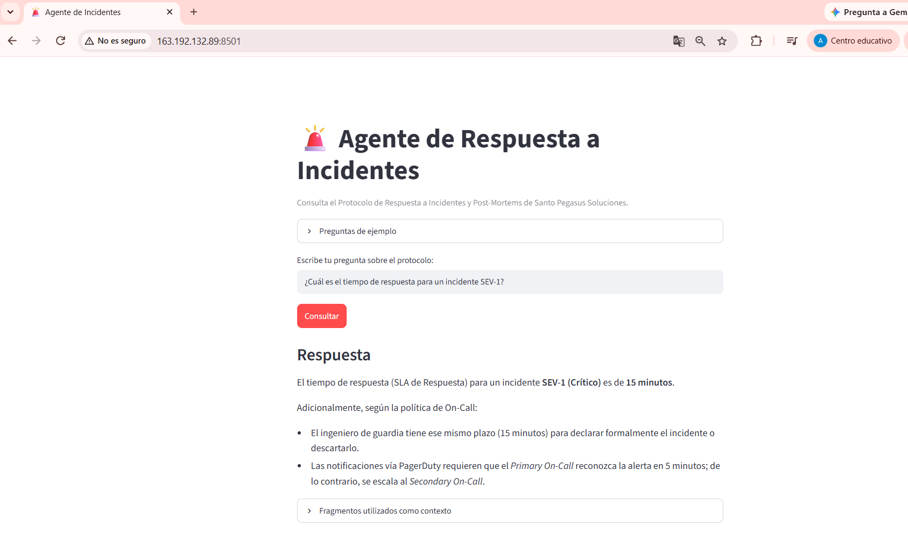

# Agente de Respuesta a Incidentes

## Descripción

Este proyecto implementa un agente de inteligencia artificial capaz de responder preguntas en lenguaje natural utilizando como única fuente el documento **Protocolo de Respuesta a Incidentes y Post-Mortems** de Santo Pegasus Soluciones.

El agente extrae el texto del PDF, lo divide en fragmentos, recupera los fragmentos más relacionados con la pregunta y solicita al modelo de lenguaje que genere una respuesta basada exclusivamente en ese contexto.

## Arquitectura

```text
Usuario
  ↓
Interfaz web en Streamlit
  ↓
Pregunta en lenguaje natural
  ↓
Recuperación de fragmentos relevantes con TF-IDF
  ↓
Contexto extraído del PDF
  ↓
Modelo Gemini
  ↓
Respuesta basada en el documento
```

### Procesamiento del documento

```text
PDF → PyPDF → extracción de texto → LangChain Text Splitter → fragmentos → índice TF-IDF
```

## Tecnologías utilizadas

- Python
- LangChain Text Splitters
- PyPDF
- Gemini API
- Scikit-learn
- Streamlit
- Git y GitHub
- Oracle Cloud Infrastructure (OCI Compute)

## Estructura del repositorio

```text
alura-agente-incidentes/
├── app.py
├── agente.py
├── requirements.txt
├── README.md
├── .env.example
├── .gitignore
├── data/
│   └── protocolo_incidentes.pdf
├── docs/
├── notebooks/
└── screenshots/
```

## Requisitos previos

- Python 3.10 o superior
- Una clave de Gemini API
- Git

## Instalación local

1. Clona el repositorio:

```bash
git clone URL_DEL_REPOSITORIO
cd alura-agente-incidentes
```

2. Crea un entorno virtual:

```bash
python -m venv venv
```

3. Activa el entorno virtual.

Windows:

```bash
venv\Scripts\activate
```

Linux o macOS:

```bash
source venv/bin/activate
```

4. Instala las dependencias:

```bash
pip install -r requirements.txt
```

5. Crea el archivo `.env` tomando como base `.env.example`:

```env
GEMINI_API_KEY=tu_clave_real
```

6. Ejecuta la aplicación:

```bash
streamlit run app.py
```

7. Abre en el navegador:

```text
http://localhost:8501
```

## Preguntas de ejemplo

- ¿Cuál es la diferencia entre un incidente y un problema?
- ¿Cuál es el tiempo de respuesta para un incidente SEV-1?
- ¿Cada cuánto debe actualizarse un incidente SEV-2?
- ¿Qué requisitos debe cumplir un cambio planificado?
- ¿Qué significa una cultura blameless?

## Ejemplos de respuestas

**Pregunta:** ¿Cuál es el tiempo de respuesta para un incidente SEV-1?

**Respuesta esperada:** El tiempo máximo de respuesta es de 15 minutos y las actualizaciones deben realizarse cada 30 minutos.

**Pregunta:** ¿Qué significa una cultura blameless?

**Respuesta esperada:** Significa que el análisis de los incidentes se enfoca en las fallas del sistema y no en culpar a las personas, promoviendo el aprendizaje y la mejora continua.

## Despliegue en OCI

La aplicación será desplegada en una instancia de OCI Compute. La instancia deberá tener Python, Git y las dependencias del proyecto instaladas. La variable `GEMINI_API_KEY` se configurará directamente en el servidor y nunca se almacenará en GitHub.

Comando de ejecución en OCI:

```bash
streamlit run app.py --server.address 0.0.0.0 --server.port 8501
```

También debe habilitarse el puerto TCP 8501 en la red de OCI y en el firewall del sistema operativo.

## Evidencia del deploy

Agregar aquí la URL pública y la captura final:

```text
http://163.192.132.89:8501/
```

## Evidencia del funcionamiento en OCI


```

## Seguridad

- No subir el archivo `.env`.
- No publicar claves de API.
- No almacenar credenciales directamente en el código.

## Autor

Anthony Molina
